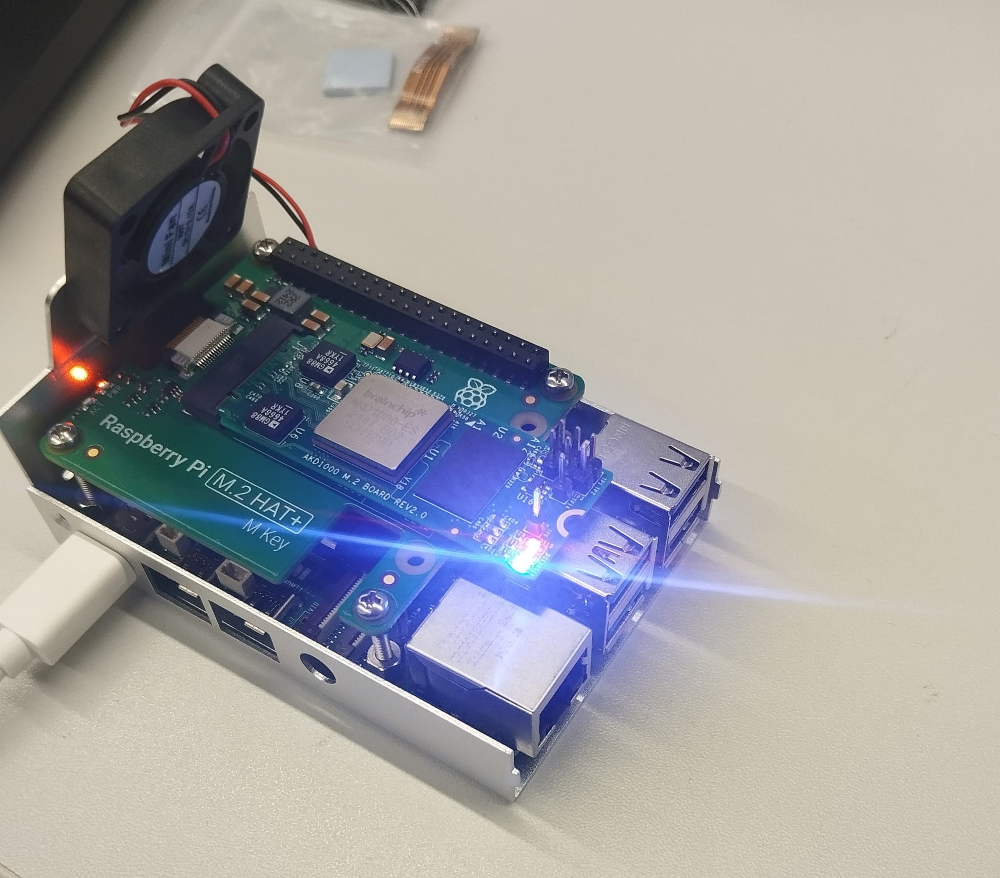

# Neuromorphic EEG Seizure Detection

**MSc Advanced Computer Science Dissertation — Cardiff University, 2026**
Supervisor: Dr. Nick Pham, Cardiff Agile CPS Lab

End-to-end pipeline for epileptic seizure detection on neuromorphic silicon: from raw scalp EEG through a quantised spatio-temporal CNN, converted to a Spiking Neural Network and deployed on a BrainChip AKD1000 neuromorphic processor at **~1 mW active power**.

The project is framed around two complementary, separately-evaluated questions rather than a single number: **C2** (per-patient fine-tuning) answers "what's actually deployable, given a short per-patient calibration window" — the clinical-practicality question. **LOPO** (rotating leave-one-patient-out cross-validation) answers "how far does a shared representation generalise cold, across patients it's never seen" — the field-comparability question. A low LOPO number does not weaken C2's deployability claim; it's the evidence for why C2's personalisation architecture is the correct design, not a fallback. See the LOPO section below for why.

---

## Hardware



*Raspberry Pi 5 with BrainChip AKD1000 REV2.0 M.2 card via PCIe M.2 HAT+*

---

## Key results

**Hardware-measured (C2, physical AKD1000 silicon):**

| Metric | Value | Notes |
|--------|-------|-------|
| Energy / inference | **~0.906 µJ** | Measured on AKD1000 silicon |
| AKD1000 active power | **~1 mW** | vs 15–50 mW on conventional MCU |

**Cross-patient generalisation (LOPO, 15/15 folds complete — see dedicated section below):**

| Metric | Value | Notes |
|--------|-------|-------|
| Event sensitivity, PASS-only mean | **0.470 ± 0.437** | 8/15 folds pass the collapse diagnostic — this is the honest headline figure |
| Event sensitivity, all-folds mean | 0.586 | Includes collapse-FAIL folds — do not quote without the PASS-only figure alongside it |
| Collapse-FAIL rate | **7/15 (47%)** | A reportable finding in its own right, not just a filter |
| Gap vs. Ali et al. (2024) comparator | +0.265 below their 72–75% midpoint | RF + hand-crafted features, different eval protocol — see caveat in LOPO section |

> Both C2 and LOPO results are reported as full metric bundles (event sensitivity, window specificity, FP/hr, collapse diagnostic) — never sensitivity alone. Full disclosure discipline documented in the Methodology Ledger (Obsidian vault, not committed to this repo).

---

## LOPO (Leave-One-Patient-Out) cross-validation — complete

Supervisor-directed methodology addition (July 2026), now complete across all 15 preprocessed patients. Unlike the earlier fixed 3-patient training pool evaluated against held-out patients (which risked pool-selection bias — the 3 chosen patients shape what "generalisation" looks like, with nothing rotating to check), LOPO rotates: for each of the 15 folds, the model trains on all 14 other patients' full recordings and is evaluated on the completely held-out 15th patient's full recording (not just a chronological test slice — standard practice for true LOPO, and what makes the comparison to Ali et al. valid).

**The most important finding is the shape of the result, not just the mean.** Among the 8 collapse-PASS folds, sensitivity clusters almost entirely at the extremes (0.0 or 1.0), not in a smooth spread — the model tends to either detect a given patient's seizures essentially perfectly or miss them almost entirely, consistent with genuine ictal-morphology heterogeneity across patients (different epileptogenic foci, seizure types, electrode-placement variance) rather than a pure data-volume problem. This is the strongest available evidence for why C2's per-patient personalisation is the architecturally correct response, not a compromise.

Methodology notes:
- Undersample ratio **5:1** (non-seizure:seizure), disclosed and fixed before any fold ran — reduced from C2's 10:1 given the larger 14-patient pool supplies more real seizure exemplars, reducing reliance on synthetic SMOTE.
- Every fold's held-out patient is evaluated on their **full recording**, since they contribute 0% of their data to training in that fold — matches standard LOPO methodology and the Ali et al. comparator directly.
- Comparability caveat: Ali et al. (2024)'s 72–75% is RF + 92 hand-crafted features, no hardware constraint, no quantisation, and very likely no collapse-diagnostic-equivalent screening for the over-triggering failure mode this project explicitly checks for. Not a reason to discount the gap, but the comparison isn't perfectly apples-to-apples.

Pipeline: `src/preprocessing/build_dataset_lopo_fold.py` (fold-aware pool builder) → `src/preprocessing/build_lopo_eval_set.py` (full-recording eval set) → `train_baseline.py --pool-tag` → `convert_to_snn.py` → `eval_event_level.py --lopo-full`, orchestrated end-to-end by `run_lopo_sweep.sh`, aggregated by `src/evaluation/aggregate_lopo_results.py`.

---
## Full method comparison

| Method | What it answers | Event sensitivity | FP/hr | Collapse/Verdict |
|---|---|---|---|---|
| **C1** (frozen 3-patient pool, zero target data) | Cold cross-patient baseline | 0.343 ± 0.433 | 1.734 ± 2.496 | 60 seed×patient runs, 12 held-out patients — confirmed final number |
| **LOPO** (rotating, all-folds) | — | 0.586 ± 0.445 | 4.00 | 15/15 folds, **not the reportable number** (inflated by collapse artifacts) |
| **LOPO** (PASS-only) | Cold generalisation, field comparability | **0.470 ± 0.437** | 4.42 | 8/15 folds pass; **headline dissertation figure** |
| **C2** (per-patient fine-tune) | Deployability, short calibration window | 1.000 / 0.667 / 0.571 / 0.200 | 5.46 / 2.42 / 1.33 / 9.83 | chb10 / chb13 / chb15 / chb16 — mixed, n=4 |
| **DANN** (λ=0.1) | Adversarial domain-invariance | 0.167 | — | chb13, collapse-FAIL (over-firing) |
| **CORAL** (λ=0.01) | Statistical covariance alignment | 0.167 | — | chb13, collapse-FAIL (over-firing) |
| **SSL-pretrain** | Self-supervised init, no domain signal | 0.167 | — | chb13, collapse-FAIL (over-firing) |
| **Candidate G** (3-seed mean) | Hand-engineered spectral features | 0.889 ± 0.157 | — | chb13, collapse-FAIL (over-firing, different magnitude) |
| **C3 compounding** (aux head, focal loss, distillation) | Stack on top of C2 | — | — | All closed negative, no improvement over C2 alone |

### Pool expansion experiment (July 2026) — does the model learn from more data?

Supervisor-directed addition: a second training pool (**pool7** — chb01/02/05/06/07/09/20, vs. the original **C1** 3-patient pool chb01/02/05) was trained and evaluated to demonstrate the model learns from data it has access to, as a simpler sanity check before the harder LOPO cross-patient test. All patients below evaluated with `--lopo-full` (full patient recordings, not chronological test slices).

**Does pool7 learn its own training patients?**

| Patient | Event sensitivity | Events | AUPRC | ROC-AUC | Collapse |
|---|---|---|---|---|---|
| chb01 | 1.000 | 7/7 | 0.871 | 0.9996 | PASS |
| chb02 | 1.000 | 3/3 | 0.648 | 0.985 | PASS |
| chb05 | 1.000 | 5/5 | 0.928 | 0.9997 | PASS |
| chb06 | 0.000 | 0/10 | 0.001 | 0.541 | PASS |
| chb07 | 1.000 | 3/3 | 0.265 | 0.963 | PASS |
| chb09 | 1.000 | 4/4 | 0.607 | 0.989 | PASS |
| chb20 | 1.000 | 8/8 | 0.544 | 0.989 | PASS |

6/7 patients achieve perfect event-level sensitivity with strong AUPRC/ROC-AUC, all genuinely collapse-PASS (not over-firing artifacts) — confirms the model learns real ictal structure rather than a threshold artifact. chb06 is a genuine, explicable exception: lowest raw seizure count (163 windows) and smallest post-SMOTE contribution of any pool7 patient, illustrating that pooling does not guarantee uniform learning across contributing patients.

**Fair C1-vs-pool7 comparison** — 8 patients held out from *both* models, both evaluated identically (`--lopo-full`):

| Patient | C1 sensitivity | C1 collapse | pool7 sensitivity | pool7 collapse |
|---|---|---|---|---|
| chb03 | 0.000 | FAIL | 0.000 | PASS |
| chb10 | 0.571 | PASS | 1.000 | PASS |
| chb11 | 1.000 | FAIL (over-fire) | 1.000 | FAIL |
| chb13 | 0.667 | FAIL (over-fire) | 0.083 | PASS |
| chb15 | 0.000 | FAIL | 0.000 | PASS |
| chb16 | 0.000 | PASS | 0.000 | PASS |
| chb18 | 0.000 | PASS | 0.000 | PASS |
| chb19 | 1.000 | FAIL (over-fire) | 0.333 | PASS |

**Headline finding: collapse-PASS rate improved from 3/8 (37.5%, C1) to 7/8 (87.5%, pool7).** Once filtered to genuinely trustworthy (collapse-PASS) folds, both models perform similarly on real detection ability (PASS-only mean sensitivity: C1 0.190, pool7 0.202) — expanding the pool didn't improve raw detection so much as it sharply reduced the collapse-artifact failure rate, at the cost of a higher false-positive rate among passing folds (PASS-only mean FP/hr: C1 ~0.855, pool7 ~3.69).

### ROC-AUC

Added alongside AUPRC (July 2026) for comparability with literature that reports ROC-AUC rather than AUPRC. **AUPRC remains the metric this project leads with** — ROC-AUC is known to look artificially strong under this project's severe class imbalance (~1–3% seizure-window rate), since false positive rate is diluted by a large negative-class denominator in a way precision is not. Full per-fold ROC-AUC values are stored alongside AUPRC in every `event_results_*.json`'s `window_level` block.

---

## Pipeline overview

```
CHB-MIT Scalp EEG (PhysioNet)
         │
         ▼
  preprocess.py          — bandpass 0.5–40 Hz, 18-channel pick,
                           2s windows @ 50% overlap, rate-code → spikes
         │
         ▼
  build_dataset.py       — chronological 70/15/15 split (per-patient, C2),
       or                  undersample + SMOTE on train only
  build_dataset_lopo_fold.py — N-1 patients' FULL recordings, rotating pool (LOPO)
         │
         ▼
  train_baseline.py      — spatio-temporal CNN v2, 137,826 params,
                           w4a4 quantisation (--pool-tag for LOPO folds)
         │
         ▼
  convert_to_snn.py      — ANN → SNN via MetaTF cnn2snn,
                           AkidaVersion.v1 target
         │
         ▼
  eval_event_level.py    — event-level metrics + collapse diagnostic
       (--lopo-full for LOPO's full-recording held-out eval)
         │
         ▼
  run_on_akida.py        — hardware inference on AKD1000 M.2,
  [Raspberry Pi 5]         power / latency / clinical metrics
```

---

## Architecture

**v2 spatio-temporal CNN** (primary model, AKD1000 v1 compatible, used identically for both C2 and LOPO):

```
Input (18, 512, 1)               — 18 EEG channels × 512 samples
  │
  ├─ Rescaling(1/255)            — [0,255] → [0,1] normalisation
  ├─ Conv2D (9,7) × 32           — spatio-temporal: 9 channels × 7 timesteps
  ├─ MaxPool (2,4)
  ├─ ReLU(max_value=6)
  ├─ Conv2D (3,3) × 64
  ├─ MaxPool (2,2)
  ├─ ReLU(max_value=6)
  ├─ Conv2D (3,3) × 32
  ├─ ReLU(max_value=6)
  ├─ Flatten
  ├─ Dense(64)
  ├─ ReLU(max_value=6)
  └─ Dense(2, softmax)           — [non-seizure, seizure]

Params: 137,826  |  Quantisation: w4a4  |  Spike sparsity: 90.2%
```

The (9,7) kernel is biologically motivated: seizures propagate through contiguous electrode groups (typically 6–12 channels). A 9-channel kernel covers ~50% of the 18-channel array, capturing ictal propagation extent while preserving spatial position for downstream layers.

---

## Neuromorphic hardware constraints discovered

During development, **23 previously undocumented AKD1000 v1 hardware constraints** were identified through systematic architectural probing — none are in BrainChip's public documentation. Selected critical constraints:

- Kernel heights must be **odd** (1, 3, 5, 7, 9 ... 17) — even heights fail silently at convert
- **No branching** (Concatenate, Add, Multiply) — sequential architectures only
- Block ordering must be **Conv → Pool → ReLU**, not Conv → ReLU → Pool
- **No DepthwiseConv2D or SeparableConv2D** as first layer
- `padding='valid'` required on first Conv2D (quantizeml 1.2.3 bug with `'same'`)
- `ReLU(max_value=6)` must be a **separate layer**, not `activation='relu'` inline
- GAP cannot be followed by any Dense layer — use Flatten instead
- `per_tensor_activations=True` mandatory in QuantizationParams
- `numpy >= 2.0` required (not `< 2.0` as stated in some older docs)

See [`Akd1000_v1_architecture_constraints.md`](Akd1000_v1_architecture_constraints.md) for the full list. (Note: that document's own recorded param count, 137,314, predates this session's confirmed 137,826 — worth reconciling before citing either number in the dissertation.)

---

## Dataset

**CHB-MIT Scalp EEG Database** (PhysioNet) — paediatric patients, Children's Hospital Boston. **15 patients fully preprocessed** and used in both the C2 and LOPO pipelines: chb01, chb02, chb03, chb05, chb06, chb07, chb09, chb10, chb11, chb13, chb15, chb16, chb18, chb19, chb20.

Every patient serves both roles depending on context: a **C2 personalisation target** (own chronological 70/15/15 split, fine-tuned individually) and a **LOPO pool member / held-out fold** (rotating — each patient is held out exactly once, contributing to every other fold's training pool).

Patients with a documented structural or genuine limitation, carried through both C2 and LOPO evaluation rather than excluded:
- **chb03** — ictal-phenotype mismatch, consistently near-zero cross-patient sensitivity regardless of method.
- **chb13** — hardest patient across every technique tried (DANN, CORAL, SSL, Candidate G, and LOPO), by a different failure mode each time (under-detection under representational fixes, over-triggering under LOPO).
- **chb16** — genuine AUPRC limitation (0.0235); no threshold simultaneously satisfies useful sensitivity and an acceptable FP rate.

- Window: 2.0s @ 256 Hz = 512 samples, 50% overlap
- Channels: 18 (common set, positions 0–17)
- Class imbalance: ~1:329 (seizure : non-seizure) native; undersampled 10:1 for C2, 5:1 for LOPO (see LOPO section for rationale)
- Handled via: chronological split (C2) or rotating full-recording pool (LOPO) → undersample → SMOTE on train only, real val/test never touched

---

## Stack

| Component | Version |
|-----------|---------|
| Python | 3.11.x |
| TensorFlow | 2.19.x |
| tf-keras | 2.19.0 |
| akida | 2.19.1 |
| cnn2snn | 2.19.1 |
| quantizeml | 1.2.3 |
| numpy | ≥2.0 |
| OS (dev) | Ubuntu (WSL2) |
| OS (deploy) | RPi OS Bookworm 64-bit |

---

## Setup

```bash
python3.11 -m venv ~/venvs/akida_env
source ~/venvs/akida_env/bin/activate
pip install -r requirements.txt
pip install -e .
```

> ⚠️ **Critical import rule** — MetaTF requires Keras 2, not Keras 3:
> ```python
> import tf_keras as keras          # ✅ always
> from tensorflow import keras      # ❌ imports Keras 3, breaks MetaTF
> import keras                      # ❌ imports Keras 3 standalone
> ```

---

## Run order

**C2 (per-patient personalisation):**

```bash
# 1. Preprocessing (WSL2)
python3 src/preprocessing/preprocess.py --patient chb01
python3 src/preprocessing/build_dataset.py --patient chb01

# 2. Smoke test — must pass before full training
python3 src/models/smoke_test.py --gate 2

# 3. Training (WSL2, RTX 3060)
python3 src/models/train_baseline.py --patient chb01 --model-version 2 --class-weight 1.5

# 4. SNN conversion
python3 src/models/convert_to_snn.py --patient chb01 --model-version 2

# 5. Hardware inference (Raspberry Pi 5)
python3 src/hardware/run_on_akida.py --patient chb01 --n-eval 500
```

**LOPO (rotating cross-patient sweep, all 15 folds):**

```bash
bash run_lopo_sweep.sh                       # full sweep
bash run_lopo_sweep.sh chb10 chb13           # or specific folds only
python3 src/evaluation/aggregate_lopo_results.py
```

---

## Repository structure

```
dissertation/
├── src/
│   ├── preprocessing/
│   │   ├── preprocess.py              — EEG windowing, filtering, spike encoding
│   │   ├── build_dataset.py           — chronological split, SMOTE balancing (C2)
│   │   ├── build_dataset_lopo_fold.py — rotating pool builder, full recordings (LOPO)
│   │   └── build_lopo_eval_set.py     — full-recording held-out eval set (LOPO)
│   ├── models/
│   │   ├── akida_cnn.py               — v1 architecture (1,7) temporal-only
│   │   ├── akida_cnn_v2.py            — v2 architecture (9,7) spatio-temporal ← primary
│   │   ├── train_baseline.py          — training + patient fine-tuning + LOPO fold training
│   │   ├── convert_to_snn.py          — ANN→SNN conversion, AkidaVersion.v1
│   │   └── smoke_test.py              — gates 1/2/3 compatibility checks
│   ├── evaluation/
│   │   ├── eval_event_level.py        — event-level metrics, collapse diagnostic, --lopo-full
│   │   └── aggregate_lopo_results.py  — aggregates all 15 LOPO fold results
│   └── hardware/
│       └── run_on_akida.py            — chip inference, power/latency measurement
├── run_lopo_sweep.sh                  — end-to-end LOPO orchestration, all 15 folds
├── data/
│   ├── raw/chbmit/                    — CHB-MIT EDF files (not tracked — see PhysioNet)
│   └── processed/                     — .npz datasets, raw windows (not tracked — gitignored)
├── results/                           — trained models (.h5, .fbz), metrics (.json)
├── assets/                            — hardware photos, diagrams
└── writing/                           — dissertation chapters (starting)
```

> Note: `data/` is fully gitignored (not Git LFS) — raw EDFs and processed `.npz`/`.npy` arrays are regenerated locally from PhysioNet + the preprocessing scripts, not version-controlled. `results/` binary checkpoints (`.h5`/`.fbz`) are committed directly; revisiting Git LFS for these is an open item as the repo approaches project end.

---

## Current status

| Phase | Status |
|-------|--------|
| Phase 1 — Preprocessing (15 patients) | ✅ Complete |
| Phase 2a — Model development + ablations | ✅ Complete |
| Phase 2b — Hardware deployment (AKD1000) | ✅ Complete |
| Phase 2c — Cross-patient generalisation (C1, representational candidates: DANN/CORAL/SSL/Candidate G) | ✅ Closed (converged negative — see ledger) |
| Phase 2d — LOPO (rotating, 15/15 folds) | ✅ Complete |
| Phase 2e — Pool expansion (pool7) + ROC-AUC diagnostic | ✅ Complete |
| Power measurement (bench DC supply) | 🔄 Scheduled next |
| Hardware robustness (makerspace enclosure) |✅ Complete |
| Phase 3 — Dissertation write-up | 🔄 Starting |

---

## References

- Shoeb, A. & Guttag, J. (2010). Application of machine learning to epileptic seizure onset detection. *ICML 2010*. [CHB-MIT dataset]
- Wu, Y. et al. (2018). Spatio-temporal backpropagation for training high-performance spiking neural networks. *Frontiers in Neuroscience*, 12, 331.
- BrainChip Inc. (2023). AKD1000 SoC Product Brief. [BrainChip technical documentation]
- Chawla, N.V. et al. (2002). SMOTE: Synthetic minority over-sampling technique. *JAIR*, 16, 321–357.
- Ali, et al. (2024). True leave-one-patient-out cross-validation benchmark for CHB-MIT seizure detection (RF + 92 hand-crafted features) — primary LOPO comparator, 72–75% event sensitivity. *(Verify full citation details before submission.)*

---

*Deadline: 10 September 2026 · Cardiff University · Supervised by Dr. Nick Pham*
